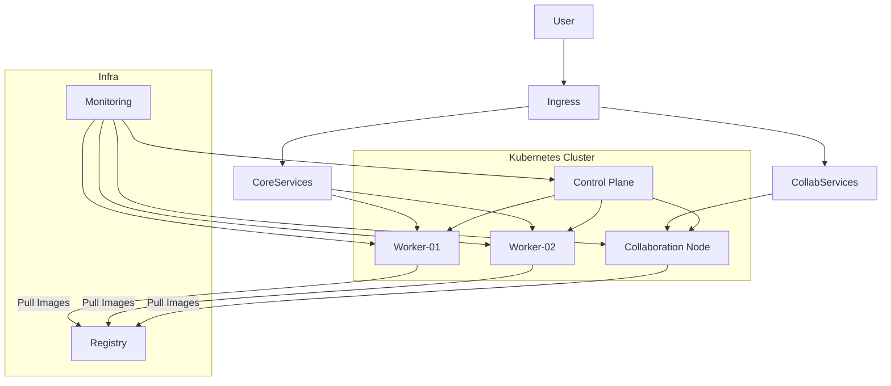

# Kubernetes Enterprise Architecture – alefba2.ir

## Rocky Linux 10 – Revision 3 (Registry & Nexus Infrastructure)

> **Owner:** Soroush  
> **Scope:** Enterprise Kubernetes Platform (Iran‑friendly, Secure, Scalable)

---

## 1. Design Principles

- تمامی سیستم‌عامل‌ها: **Rocky Linux 10** (بدون استثناء)
- استفاده از **Private Docker Registry داخلی** برای عبور از تحریم‌ها
- Kubernetes Production‑Grade با قابلیت توسعه در آینده
- تفکیک بارهای سنگین (Heavy Workloads) از Core Cluster
- امنیت بالا (Defense in Depth)

---

## 2. Physical Infrastructure

| Host      | RAM   | CPU      | Disk   | Hypervisor |
|-----------|-------|----------|--------|------------|
| Server‑55 | 64 GB | 50 Cores | 1.5 TB | VMware     |
| Server‑50 | 64 GB | 50 Cores | 1.5 TB | VMware     |

---

## 3. Phase 1 – VM & Node Layout (Revised)

### Server‑55 (VMware)

| VM            | Role                 | CPU     | RAM   | Disk   | IP             | 
|---------------|----------------------|---------|-------|--------|----------------|
| k8s-cp-01     | Control Plane        | 8 vCPU  | 16 GB | 200 GB | 192.168.10.151 |
| k8s-worker-01 | Core Worker          | 16 vCPU | 32 GB | 800 GB | 192.168.10.152 |
| monitoring    | Monitoring / Logging | 8 vCPU  | 16 GB | 600 GB | 192.168.10.155 |

---

### Server‑50 (VMware)

| VM            | Role                               | CPU     | RAM   | Disk    | IP             |
|---------------|------------------------------------|---------|-------|---------|----------------|
| k8s-worker-02 | Core Worker                        | 16 vCPU | 32 GB | 800 GB  | 192.168.10.153 |
| k8s-collab-01 | Jira / Confluence / Nextcloud Node | 12 vCPU | 24 GB | 700 GB  | 192.168.10.154 |
| registry      | Docker Registry + Nexus            | 8 vCPU  | 16 GB | 500+ GB | 192.168.10.160 |

---

## 4. Node Responsibilities

### Core Workers

- Java Microservices
- Kafka / ClickHouse / CockroachDB
- CI/CD Runners

### Collaboration Node (k8s-collab-01)

> **Purpose:** Isolation of RAM & IO heavy enterprise tools

- Jira Data Center
- Confluence Data Center
- Nextcloud
- Dedicated Persistent Volumes
- NodeSelector + Taints

```yaml
node-role.kubernetes.io/collab=true
```

---

## 5. Logical Architecture Diagram



---

## 6. Base OS – Rocky Linux 10 Hardening

- SELinux: **Enforcing**
- cgroup v2 (default)
- swap disabled
- tuned‑profile: throughput-performance
- kernel params:

```bash
vm.max_map_count=262144
fs.inotify.max_user_instances=8192
fs.inotify.max_user_watches=524288
```

---

## 7. Kubernetes Stack

### Core

- Kubernetes (latest stable)
- containerd
- Helm v3

### Networking

- Calico CNI
- NetworkPolicy (default deny)

### Ingress & TLS

- ingress-nginx (DaemonSet)
- cert-manager
- wildcard TLS for `*.alefba2.ir`

---

## 8. Domain Strategy

### 8.1. دامنه‌های alefba2.ir (Kubernetes Services)

| Service    | Domain                |
|------------|-----------------------|
| Jira       | jira.alefba2.ir       |
| Confluence | confluence.alefba2.ir |
| Nextcloud  | cloud.alefba2.ir      |
| Git        | git.alefba2.ir        |
| Jenkins    | jenkins.alefba2.ir    |
| Grafana    | grafana.alefba2.ir    |

### 8.2. دامنه‌های alefba2.ir (Registry & Nexus Infrastructure)

| Service     | Domain         | Description                |
|-------------|----------------|----------------------------|
| Registry    | rr.alefba2.ir  | Docker Registry API        |
| Registry UI | reg.alefba2.ir | Docker Registry UI (joxit) |
| Nexus       | mn.alefba2.ir  | Nexus Repository Manager   |

**نکته:** تمام دامنه‌ها با **CDN ابرآروان** مدیریت می‌شوند و **HTTPS** با **certbot** فعال است.

---

## 9. Installation Order (Step‑by‑Step)

### Phase A – OS Preparation

1. Install Rocky Linux 10
2. Apply OS hardening
3. Install containerd

---

### Phase B – Kubernetes Bootstrap

```bash
kubeadm init --pod-network-cidr=192.168.0.0/16
```

- Join workers
- Label & taint collaboration node

---

### Phase C – Networking

```bash
helm repo add projectcalico https://docs.tigera.io/calico/charts
helm install calico projectcalico/tigera-operator
```

---

### Phase D – Core Add-ons

| Component      | Helm Chart            |
|----------------|-----------------------|
| Metrics Server | metrics-server        |
| Ingress        | ingress-nginx         |
| cert-manager   | jetstack/cert-manager |

---

### Phase E – Monitoring

- kube-prometheus-stack
- Loki + Promtail
- Tempo

---

### Phase F – Collaboration Stack

| Service       | Helm Chart            |
|---------------|-----------------------|
| Jira DC       | atlassian-data-center |
| Confluence DC | atlassian-data-center |
| Nextcloud     | nextcloud/nextcloud   |

> All pinned to `k8s-collab-01`

---

## 10. Security

- RBAC least privilege
- PodSecurityAdmission (restricted)
- NetworkPolicies
- Trivy Operator
- Falco Runtime Security

---

## 11. Autoscaling & Performance

- Metrics Server
- HPA (CPU / Memory)
- JVM tuning per service
- IO isolation per node

---

## 12. Backup Strategy

- Velero (namespace‑based)
- Daily PV snapshots
- Registry image backups

---

## 13. Phase 2 – Future Expansion

- Add 3rd physical server
- 3× Control Plane
- Full HA + etcd quorum

---

## 14. Advanced Operational Add-ons (Planned – Next Phase)

> این بخش عمداً به‌صورت **Design + Ready-to-Implement** نوشته شده تا در فاز بعدی وارد اجرای عملی شویم.

---

### 🔐 14.1 Hardening for Jira / Confluence / Nextcloud

**Node-level:**

- Dedicated node (`k8s-collab-01`)
- SELinux enforcing + custom contexts for PV paths
- Strict firewall rules (Ingress-only access)

**Kubernetes-level:**

- Separate namespaces
- Default deny NetworkPolicy
- ResourceQuota + LimitRange
- PodSecurityAdmission = restricted
- Non-root containers

---

### 📦 14.2 Persistent Volume Design (Collaboration Node)

- Local Persistent Volumes (node-bound)
- Separate disks or disk partitions per service:
    - Jira Home
    - Confluence Home
    - Nextcloud Data
- Mount options optimized for IO
- Daily snapshot-based backup

> ⚠️ These workloads are **not movable** without backup/restore by design

---

### 🔄 14.3 CI/CD Flow (Enterprise)

```text
Developer
   ↓
Git (Internal)
   ↓
Jenkins (Pipeline as Code)
   ↓
Build & Test
   ↓
Push Image → Private Registry (Iran)
   ↓
Helm Upgrade
   ↓
Kubernetes Deploy
```

**Key Points:**

- No direct internet dependency at runtime
- All base images mirrored in registry
- Image scanning before deploy (Trivy)

---

### 🧭 14.4 Operational Runbook (Planned)

- Node restart procedures
- Safe pod eviction
- Disaster recovery steps
- etcd backup/restore (future HA phase)
- Jira/Confluence restore drills

---

### 📊 14.5 Capacity Planning – Insurance System

- JVM services: CPU-bound + Memory-sensitive
- Databases: IO-bound + Memory-heavy
- Jira/Confluence: RAM killers (isolated)
- Horizontal scaling via HPA
- Vertical scaling via node expansion

---

## 15. Network & System Conventions

### 15.1 IP Addressing Plan (Mandatory)

All Linux nodes **must** use static IPs in the following range:

```
192.168.10.151 – 192.168.10.199
```

Example:

| Hostname      | Role           | IP             |
|---------------|----------------|----------------|
| k8s-cp-01     | Control Plane  | 192.168.10.151 |
| k8s-worker-01 | Worker         | 192.168.10.152 |
| k8s-worker-02 | Worker         | 192.168.10.153 |
| k8s-collab-01 | Collaboration  | 192.168.10.154 |
| monitoring    | Monitoring     | 192.168.10.155 |
| registry      | Registry+Nexus | 192.168.10.160 |

192.168.10.151 k8s-cp-01     
192.168.10.152 k8s-worker-01
192.168.10.153 k8s-worker-02
192.168.10.154 k8s-collab-01
192.168.10.155 monitoring    
192.168.10.160 registry

---

### 15.2 Hostname & DNS Rules

- Hostname must match node role
- `/etc/hosts` must be consistent across all nodes
- FQDN recommended internally

---

## 16. GUI Linux Requirement

- One **Rocky Linux 10 + GNOME** VM required
- Purpose:
    - GUI-based administration
    - Browsers with VPN / Proxy
    - Emergency access

> This node **must NOT** be part of Kubernetes

---

## 17. Internet Access & Sanctions Bypass Strategy

### Netherlands Relay Server

- External server IP:

```
141.11.250.229
```

### Usage Scenarios

- Docker image mirroring
- GitHub access
- Helm repo sync
- Package downloads

### Implementation Options (Planned)

- SOCKS5 / HTTP Proxy
- SSH Dynamic Tunnel
- Selective routing (only blocked destinations)

> ❗ Production workloads must **never** depend on direct global internet

---

## 18. Registry & Nexus Infrastructure

### 18.1. Docker Registry

**سرور:** `registry` (192.168.10.160)  
**دامنه:** `rr.alefba2.ir`  
**UI دامنه:** `reg.alefba2.ir`  
**احراز هویت:** `admin:<pass>`

**ویژگی‌ها:**

- Private Docker Registry با احراز هویت
- Registry UI با joxit/docker-registry-ui
- HTTPS با certbot
- Nginx reverse proxy
- CDN ابرآروان

**استفاده:**

```bash
# Pull image
sudo ctr images pull --user 'admin:<pass>' rr.alefba2.ir/joxit/docker-registry-ui:2.6.0

# Run container
sudo nerdctl run -d \
  --name registry-ui \
  --restart unless-stopped \
  -p 8080:80 \
  -e REGISTRY_URL=http://127.0.0.1:5000 \
  rr.alefba2.ir/joxit/docker-registry-ui:2.6.0
```

### 18.2. Nexus Repository Manager

**سرور:** `registry` (192.168.10.160)  
**دامنه:** `mn.alefba2.ir`  
**احراز هویت:** `admin` (password در `/opt/sonatype-work/nexus3/admin.password`)

**Repositoryها:**

- `k8s-manifests` - برای Kubernetes manifests
- `helm-charts` - برای Helm charts
- `maven-releases` - برای Maven artifacts (releases)
- `maven-snapshots` - برای Maven artifacts (snapshots)
- `npm-private` - برای npm packages
- `docker-private` - برای Docker images (اختیاری)

**استفاده:**

**Push Manifest:**

```bash
curl -u admin:PASS --upload-file deployment.yaml \
  https://mn.alefba2.ir/repository/k8s-manifests/deployments/app.yaml
```

**Pull Manifest:**

```bash
kubectl apply -f https://mn.alefba2.ir/repository/k8s-manifests/deployments/app.yaml
```

**Push Helm Chart:**

```bash
helm package ./my-chart
helm repo index . --url https://mn.alefba2.ir/repository/helm-charts/
curl -u k8s-reader:Token -T ./my-chart-0.1.0.tgz \
  https://mn.alefba2.ir/repository/helm-charts/
curl -u k8s-reader:Token -T ./index.yaml \
  https://mn.alefba2.ir/repository/helm-charts/
```

**استفاده در Helm:**

```bash
helm repo add my-nexus https://mn.alefba2.ir/repository/helm-charts/ \
  --username k8s-reader --password <Token>
helm repo update
helm install myapp my-nexus/my-chart
```

### 18.3. الزامات استفاده

**مهم:** تمام images، manifests و charts باید ابتدا در registry/nexus push شوند و سپس از آنجا استفاده شوند. هیچ image یا
manifest مستقیم از اینترنت استفاده نمی‌شود.

**پیکربندی Kubernetes Nodes:**
تمام Kubernetes nodes باید containerd را برای استفاده از registry پیکربندی کنند:

```bash
# روی هر Kubernetes node
sudo mkdir -p /etc/containerd/certs.d/rr.alefba2.ir

cat > /etc/containerd/certs.d/rr.alefba2.ir/hosts.toml <<EOF
server = "https://rr.alefba2.ir"

[host."https://rr.alefba2.ir"]
  capabilities = ["pull", "resolve"]
  skip_verify = true
  [host."https://rr.alefba2.ir".auth]
    username = "admin"
    password = "<pass>"
EOF

sudo systemctl restart containerd
```

**مستندات کامل:**

- برای جزئیات کامل راه‌اندازی، به [مستندات Registry و Nexus](Infrastructure-Registry-Nexus-Setup) مراجعه کنید.
- برای لیست کامل تمام images و charts مورد نیاز،
  به [لیست کامل Images و Helm Charts](Complete-Images-Manifests-Helm-Charts-List) مراجعه کنید.

---

## 19. Final Notes

- Architecture is execution-ready
- Next step: OS installation & baseline config
- Registry & Nexus setup: See [Infrastructure-Registry-Nexus-Setup](Infrastructure-Registry-Nexus-Setup)
- This document is the **single source of truth**

---

❤️ Maintained by Soroush
